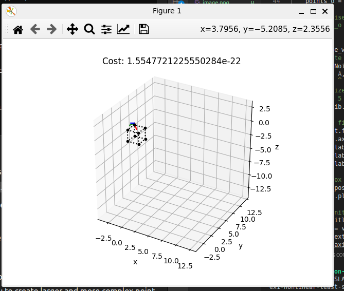

# Lab 4 - Nonlinear MAP estimation
Welcome to Lab 4!
We will here experiment with nonlinear MAP estimation.

I have made the following examples:
  - [ex1-nonlinear-least-squares-estimation.py](ex1-nonlinear-least-squares-estimation.py)
  - [ex2-map-estimation.py](ex2-map-estimation.py)

They both use the Gauss-Newton algorithm implemented in [optim.py](optim.py)
I have this week chosen to give a number of suggested experiments based on these examples.

You can install all dependencies using `pip`:
```bash
pip install -r requirements.txt
```

## Suggested experiments
1. Play around with [ex1-nonlinear-least-squares-estimation.py](ex1-nonlinear-least-squares-estimation.py)
  

    - How does it perform on initial states far from the true state?

      Suprisingly well, the algorithm converges to the true state even when the initial state is far from the true state. I know this might be a problem with this method, that it might diverge. But in this case, it converges to the true state (I multiplied the random noise with 100.0).

    - What happens when you change the true pose?
      
      The algorithm converges to the true state, even when the true pose is changed. The algorithm is robust to changes in the true pose. I tried changing in all angles and 


    - Does the cost always decrease?

      I know that it does not have to decrease. But again in this case it does so. 
      When there is no noise on the observed points


    - Can you make the problem diverge?

      I tried to make the problem diverge by changing the initial state to a random state. But the algorithm still converges to the true state. But it has stopped working, i guess this actually is a diverging case.

      I can make the method fail. By perturbing one of the angles in the initial guess by pi and all other with zero. But This might be an error with the gimbal lock. OR that the linearized model is not valid for this case. This worked for the case where the initial guess was far from the true state.

      The linearization step is however not having any noise as it is now. So maybe with noise there it would fail.


    
2. Implement Levenberg-Marquardt in [optim.py](optim.py)
     - Use this method instead of Gauss-Newton, and compare.
    

    Takes way more iterations. Still does not work for the np.pi case. This is since it is a local minimum. 
    I found that this method was less reliable when the initial guess was very far from the true state. 

3.  Play around with [ex2-map-estimation.py](ex2-map-estimation.py)
     - Try changing the geometry and measurement noise and see how this affects the covariance estimate.
       Yes. 
     - What happens when some measurements are more noisy than others?
        The geometry is very wrong. 

     - Use Levenberg-Marquardt, how does this compare?
        Kinda the same. 

     - Add a prior distribution on the pose, and see how this affects the results.

        Tried this and it seems to work. But did not make that much of a difference.

        When comparing with against without the prior, the one without had lower cost function. But this does not imply that it is better, since the prior term is included when calculating the cost. When only checking for the error in tangent space in the last pose, then it was better with the prior.

  

 4. Extra: [Iteratively Closest Point (ICP)](https://www.youtube.com/watch?v=djnd502836w)
     - Simulate or download a point cloud you can use for ICP.
       Let one point cloud have the role as "world points", and the other "observed points" as in the examples.
       You can for example split a point cloud into two different sets by drawing points randomly
       from the original point cloud, and then transform the "observed point cloud" as in the examples. 
     - Keep the estimation framework from before (you don't need to implement the estimation methods in the video),
       but update the model so that it determines point correspondences using an ICP strategy.
     - Estimate pose using ICP!

     I feel like this was mosltly ChatGPT's work. And Github Copilot 

All in all I am still puzzled that I did not get the Gauss Newton method to diverge. Maybe that has to do with the underlying model it solves in this case. It was not that intuitive how to include the prior in the Map estimation. So I might have done it wrong. That also goes for the ICP. 